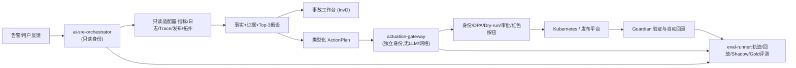

# AI SRE 能力清单与具体实现方案

> 依据:Google SRE《AI in SRE: How Google is Engineering the Future of Reliable Operations》
> (https://sre.google/resources/practices-and-processes/ai-engineering-reliable-operations/)
> 目标:提炼文章描述的 AI SRE 全部能力,并给出每项能力在自建平台上的具体实现方案。

---

## 一、文章的三个顶层框架(所有实现的约束前提)

### 1.1 自治等级模型(五个维度 × 五个等级)

Google 把 AI SRE 的自治程度拆成五个操作维度:**Monitor(监控)、Investigate(调查)、Mitigate(缓解决策)、Actuate(执行)、Self-Direct(自我规划)**,再按维度组合出 L0–L4:

| 等级 | 含义 | 人的角色 |
|---|---|---|
| L0 | 全人工 | 全部人工执行 |
| L1 | 辅助:自动监控+自动调查 | 人决策、人执行 |
| L2 | 半自治:系统可以执行 | 每次执行需人显式审批 |
| L3 | 高自治:限定场景内自动检测→决策→执行 | 人只管边界和例外 |
| L4 | 全自治:多步骤解决、自适应策略、全生命周期管理 | 人管治理 |

**晋级门槛**:L2→L3 是最关键的一步,必须用人工核验过的 Golden 数据证明"统计显著的持续高精度";L3→L4 要求具备多步骤解决能力(执行→观察→调整策略→失败换方案→恶化回滚)。

**实现要点**:自治等级不是全局开关,而是 `服务 × 场景 × 动作 × 环境` 粒度的注册表(详见 §3.9)。

### 1.2 安全三要素(Safety Trifecta)

1. **透明(Transparency)**:Agent 每一步的信号、假设、依据、置信度都要留痕(Chain of Thought 实时可视)。
2. **实时风险评估(Real-time Risk Evaluation)**:每个动作执行前结合上下文评估风险——是否有进行中的发布、错误预算余量、活跃事故、时间段(文中例子:平时排空一个 cell 是低风险,区域高峰期就是高风险)。
3. **渐进授权(Progressive Authorization)**:Agent 第一天不给生产全权,按证明过的表现逐级放权。

### 1.3 四条强制架构护栏(所有 Agent 必须满足)

1. **无环境凭证、最小权限**:Agent 不得使用开发者的常驻人类凭证;必须有独立、强认证、按需获取的身份。
2. **Agent 级熔断器**:严格的 Agent 专属限流 + 自动熔断,防止失控循环;任何 Agent 动作必须高度可中断。
3. **强制 Dry-run**:任何供 Agent 调用的系统/API 必须支持声明式 `dry_run=true`,在真正变更前预测结果和爆炸半径。
4. **零信任、默认安全的执行通道**:Agent 只能通过带确定性安全机制的受托控制面执行(文中例子:调查 Agent 想排空 cell,不能直接跑脚本,必须走委托控制面)。

---

## 二、能力全景图(文章内的系统 → 能力映射)

| 能力 | Google 的系统 | 自治级 | 文中效果数据 |
|---|---|---|---|
| 用户反馈故障检测 | Detectr(Gemini) | L1 | 累计减少数百小时客户影响 |
| 告警上下文丰富 | AI Alert | L1(只读) | ~2 分钟预算内完成 |
| 根因假设生成 | Incident Hypothesis | L1 | A/B 实验证明 MTTM 降 10% |
| 动态调查工作台 | Investigation Dashboard (InvD) | L1 | 异常发现 +195%,支持场景 MTTM 降 ~44% |
| 生产操作 CLI | Antigravity CLI + Production Agent MCP | L1 | — |
| 自主缓解 | AI Operator | L2–L3 | 已跑过数千事故 |
| 执行安全网关 | Actus | 独立控制面 | 生产写操作 100% 经它 |
| 人类轨迹采集 | IRM Analyzer (IRMA) | 数据层 | — |
| 持续评测 | Nightly Evals + LLM-as-a-Judge | 数据层 | — |

以下逐项给出具体实现方案。

---

## 三、逐项能力实现方案

### 3.1 用户反馈故障检测(对标 Detectr)

**Google 的做法**:传统遥测只能发现已知失效模式,且统计异常≠用户受损。Detectr 用 LLM 对社交媒体、客服工单、产品论坛的非结构化反馈做四段流水线:**Filter(过滤无关)→ Cluster(聚类成潜在故障)→ De-noise(去掉噪声簇)→ Report(生成结构化故障通报)**。反馈量天然指示严重度,用户提交反馈的成本本身就是噪声过滤器。

**自建实现**:
- 数据源:客服工单系统 Webhook、App 内反馈接口、官方社区/微博舆情 API,统一落入 `feedback_events` 表(字段:来源、原文、时间、产品线、地域)。
- 流水线:每 60 秒批处理一轮。
  1. Filter:LLM 分类 prompt 输出 `{is_incident_related, product, symptom_code}`,丢弃无关项;
  2. Cluster:对 `symptom_code + product + 时间窗(15min)` 做嵌入向量聚类(如 HDBSCAN);
  3. De-noise:簇内条数 < N 或来源单一的簇降级为观察;
  4. Report:对存活簇生成结构化通报 `{symptom, affected_scope, first_seen, sample_quotes, volume_curve}`,推送到事件管理平台并关联既有告警。
- 验收:通报必须带原始反馈链接;与监控告警做双向关联(用户先于监控发现的故障单独统计,这是该能力的核心价值指标)。

### 3.2 告警上下文丰富(对标 AI Alert)

**Google 的做法**:在告警到达人之前拦截,~2 分钟预算内并行查询监控、日志、变更记录、依赖图,产出:相关异常关联、最近发布/配置变更详情、相似历史事故、根因假设。**关键设计:只读模式,只给可验证事实和带证据链接的洞察,不给推测性结论。**

**自建实现**:
- 入口:Alertmanager/PagerDuty Webhook → 2 秒内返回 `incident_id` 并启动工作流。
- 并行连接器(每个独立超时 + 一次受控重试,单源失败不阻塞整体):指标(Prometheus)、日志(ES/Loki)、Trace、发布平台 API、配置中心 diff、服务拓扑、历史事故库(向量检索)。
- 时间预算(对外承诺 120 秒,内部按 90 秒设计):接入调度 2s → 并行查询 40s → 聚合去重验证 10s → 推理 25s → Schema 校验 8s → 写回 5s;80 秒未返回的源标记缺失先发布,允许事后追加。
- **事实/假设分离的数据结构**(证据覆盖率从结构上保障):

```json
{
  "facts": [
    {
      "fact_id": "fact-101",
      "text": "错误率在 v42 发布后 5 分钟从 0.2% 升至 8.1%",
      "observed_at": "2026-07-15T10:10:00Z",
      "evidence_ids": ["metric-1", "deploy-42"]
    }
  ],
  "hypotheses": [
    {
      "rank": 1,
      "cause_code": "RECENT_RELEASE_REGRESSION",
      "evidence_for": ["fact-101"],
      "evidence_against": [],
      "verification_steps": ["compare_canary_baseline"],
      "confidence": 0.93
    }
  ]
}
```

  没有 `evidence_ids` 的内容禁止进入 `facts`,只能作为待验证假设。每条证据保存查询 URL、查询参数、时间范围和数据快照。
- 验收指标:告警丰富 p95 = `enrichment_published_at - alert_received_at`(从收到告警算到事故平台成功显示,不是只算模型延迟);证据覆盖率 = 有有效证据的事实数 ÷ 全部事实数。

### 3.3 根因假设生成(对标 Incident Hypothesis)

**Google 的做法**:用 LLM + RAG 综合实时监控异常、服务 playbook、应用日志、事故管理数据和历史相似事故,给值班人**一条可信线索 + 具体验证步骤**,嵌在值班人的主工具里,最小化上下文切换。Google 用 A/B 实验证明 MTTM 降 10%。

**自建实现**:
- 输出 Top-3 候选根因(不是 Top-1),每个候选带 `cause_code`(枚举,如 RECENT_RELEASE_REGRESSION / CAPACITY_SATURATION / SINGLE_INSTANCE_ANOMALY)、支持证据、反对证据、验证步骤。
- RAG 语料:服务 playbook、历史事故复盘(结构化后入向量库)、拓扑与依赖说明。
- 验收:在 Gold 标注数据上 Top-3 召回率 ≥85%;上线后照搬 Google 的验证方式——按事故随机分流做 A/B,对比 MTTM,而不是自报感受。

### 3.4 动态调查工作台(对标 InvD)

**Google 的做法**:替代"在多个静态仪表盘间打猎",按事故动态生成"单一视图"。四层递进能力:①ML 时序异常检测 → ②异常与变更关联 → ③判断异常是否值得调查 → ④判定是否为真正根因(如最近发布、实验、容量迁移)。架构上是可扩展生态:各产品团队贡献了 100+ 领域专属 "troubleshooter" 并行执行症状检查。效果:异常发现 +195%,支持场景 MTTM 降 ~44%。

**自建实现**:
- 工作台页面按 `incident_id` 生成:时间线(告警、变更、异常按时间轴对齐)、异常面板、发布关联面板、Top-3 假设、建议动作。
- 异常检测先用简单稳健的方法(STL 分解 + 残差 z-score / EWMA),不必上复杂模型;关键是把"异常↔变更"在时间轴上自动对齐。
- 预留 troubleshooter 插件接口:`check(incident_context) -> finding[]`,让业务团队用统一契约贡献领域检查(如"连接池水位检查""慢 SQL 检查"),并行执行、结果汇入事实列表。
- 验收:值班人首轮调查不需要跳出工作台。

### 3.5 生产操作 CLI 与工具接口(对标 Antigravity CLI + Production Agent MCP)

**Google 的做法**:Gemini CLI 通过标准化的 Production Agent MCP server 访问生产:查监控、搜日志、取事故详情、查依赖配置,以及发起"安全的、策略合规的缓解"(如流量排空)——写动作全部经过 Mitigation Safety Verification Service 把关。能力以模块化 Skills 库组织,附风险说明。

**自建实现**:
- 用 MCP 规范把内部工具统一暴露:observability 查询、事故管理读写、流量/容量操作、基础设施巡检四类 server。
- **只读工具和写工具物理分离**:读工具 Orchestrator 直连;写工具只在执行网关内部注册,Agent 侧只能"提案",不能直呼。
- Skills 库:每个 skill 是"一段可复用的操作流程 + 前置条件 + 风险等级"元数据,禁止 Agent 生成任意 shell。

### 3.6 自主缓解 Agent(对标 AI Operator)

**Google 的做法**:作为告警的第一响应者,并行调查、形成并检验假设做 RCA。推理由人类专家历史调查案例引导。动态消费三类上下文:**Enrichers(确定性信号增强)、Specialized Skills(缓解方法)、Few-shot Prompts(调查策略引导)**,三者有多少用多少。当前关键操作停在 L2(人审批),小事故 L3 自动执行。执行后等待预设时间验证是否解决;未解决则发起 post-actuation 二次调查换策略。复杂场景可派生子 Agent。**每步 token 最小化管理,防止长事故 CoT 导致上下文丢失/幻觉。**无法定位或越界时立即升级人工,同时把完整调查历史写入事故平台。每次执行轨迹入库(Google 用 Spanner),失败案例由 LLM-as-a-Judge 自动生成批评意见并建 bug 单——failure-driven development。

**自建实现(MVP 收敛到两个可逆动作)**:
- `scale_out`:扩容 10%–25%。前置条件:无状态、配额充足、无进行中发布、成本未越界。成功条件:5 分钟内新副本 Ready、SLI 改善、无新增 CrashLoop。失败:恢复原副本数并升级人工。
- `rollback_release`:回滚到上一稳定版本(有成熟 Feature Flag 时优先用开关代替二进制回滚)。前置条件:故障与最近发布强相关、无 DB schema 变更、无需保留的安全补丁、上一版本制品可用、dry-run 通过。成功条件:连续 5 分钟 SLI 恢复、无新错误类型。恶化则重新部署原版本并停自动化。
- 动作契约(不可变 ActionPlan,审批绑定 `action_id + plan_hash`,参数变化即失效):

```json
{
  "action_type": "scale_out",
  "target": {"cluster": "prod-cn-east", "namespace": "payment", "workload": "payment-api"},
  "parameters": {"original_replicas": 20, "target_replicas": 24},
  "preconditions": ["quota_available", "no_active_rollout", "current_replicas=20"],
  "success_criteria": ["error_rate<1%", "slo_burn_rate<2"],
  "rollback": {"action_type": "restore_replicas", "target_replicas": 20},
  "idempotency_key": "inc-001-scale-out-v1",
  "expires_at": "2026-07-15T10:20:00Z",
  "dry_run_required": true
}
```

- Post-actuation Guardian:执行后持续观测 SLI/容量/错误预算,预设窗口未达成功条件自动触发 rollback 字段定义的补偿动作。
- CoT 全程写入集中 UI,值班人可插话引导;每步只携带最小必要上下文(结构化状态外置存储,不靠对话历史)。

### 3.7 执行安全网关(对标 Actus)——整个体系的安全核心

**Google 的做法**:所有自主生产变更的统一控制面。核心原则:**AI Operator 不直接接触基础设施,只向 Actus 提案**。三阶段生命周期:
1. **发现与规划**:提供动态过滤的可用缓解工具注册表;收到 EvaluateAction 后补全参数,把 LLM 意图翻译成具体可验证的执行计划;
2. **动态自治与护栏**:强制 dry-run、动作必须对应打开中的事故(justification 校验)、并发动作检查;**实时降级**——Agent 请求 L3 执行但风险分升高或生产状态异常时,自动降为 L2 转人工审批;
3. **执行后守护**:维护 LRO 状态、轮询验证成败、集中 Guardian 层,以及紧急"红色按钮":瞬时暂停所有在途动作、阻止新动作、全局吊销 L3 权限。

架构收益(文章原则):**把推理引擎与执行引擎解耦,无论模型怎么进化,变更生产的能力始终被确定性的、人类控制的安全边界约束。**

**自建实现**:
- 独立部署组件 `actuation-gateway`:不能访问 LLM 和互联网,只接受符合 Schema、签名正确、未过期的 ActionPlan;Kubernetes 写凭证只存在于它体内,Orchestrator 只有只读身份。
- 执行前检查链(顺序执行,任一失败即拒绝):

```text
红色按钮状态 → Agent 独立身份 → Action Schema → TTL → 幂等检查
→ 事故仍然有效 → 服务/场景/动作白名单 → 并发锁 → Dry-run
→ OPA 策略 → L2 审批或 L3 资格 → 执行 → Guardian → 审计
```

- 策略引擎用 OPA:策略判断与程序执行分离;Kill Switch 存强一致存储,计划评估和实际执行前各查一次;触发后取消未执行动作、阻止新动作、撤销自动执行身份。
- 一切依赖(网关、Orchestrator、模型)不可用时 fail closed;原有人工值班链路不得依赖 AI SRE。
- Kubernetes 服务端 dry-run 验证变更;发布回滚结合渐进式发布(如 Argo Rollouts 的 analysis)。

### 3.8 评测数据与记忆(对标 IRMA + Bronze/Silver/Gold + Nightly Evals)

**Google 的做法**:
- **IRMA** 用 NLP 解析聊天记录、事故笔记、CLI 记录,重建人类处置的时间序列轨迹(事件、动作如"排空了 cell xx"、工具、假设),作为 Agent 学习和评测的原料。
- **数据三层**:Bronze(自动标注器启发式生成)→ Silver(程序生成、用 Gold 做数学校准并带置信阈值)→ Gold(人类专家核验)。用分层抽样持续抽事故做人工复核生成 Gold,从而度量"True Precision vs Observed Precision",在 Agent 上生产前留出统计显著的安全边际。
- **Nightly Evals**:每晚对滚动更新的真实事故数据集评测。混合评法:LLM-as-a-Judge 评中间推理、调查轨迹、工具调用;**最终缓解动作用确定性精确匹配打分——必须与 Golden 数据的完全可执行参数(具体二进制和版本号)一致才算对,含糊建议不算**。
- **Golden 数据低成本生成**:值班人宣布事故已缓解时,系统主动生成"你刚才应用的缓解动作"结构化建议,值班人在标准流程里接受/修改/拒绝,持续回流高质量标注,零额外负担。

**自建实现**:
- 轨迹存储:每次 Agent 执行的完整 trace(模型、prompt 版本、工具调用、策略版本、输入输出哈希)入库,支持时间切片回放。
- 回放 + Shadow:历史事故做时间切片回放;线上 Shadow 模式只生成 ActionPlan 不执行,与人类实际处置对比。累积 ≥500 个有效案例作为 L3 准入前提。
- Gold 生成流程照搬 Google:事故关单时弹出"本次实际缓解动作"预填表单,值班人一键确认/修正。
- 每周抽检 max(100 条, 20%) 事实做人工判定,计算无证据事实错误率。
- 失败驱动开发:每个判错案例自动生成批评 + 改进任务单。

### 3.9 自治等级注册与晋降级

**实现**(承接 §1.1 和 Actus 的实时降级):
- 注册表粒度:`服务 + 场景(cause_code) + 动作 + 环境`,如 `payment-api + RECENT_RELEASE_REGRESSION + rollback_release + prod-cn-east = L2_APPROVAL`。禁止给 Agent 全局 L3。
- 状态机:`SHADOW → L2_APPROVAL → L3_AUTO`,任意状态可进 `SUSPENDED`。
- L3 晋级条件(程序只计算是否达标,最终晋级双人批准):≥500 回放/Shadow 案例、≥50 次真实 L2 执行、连续 8 周核心指标达标、500 案例中 ≥498 个动作参数精确匹配(点估计 99.6%)、策略绕过和严重错误动作为 0、故障注入与回滚演练通过率 100%。
- 自动降级触发:任一严重错误动作;连续 7 天精度或证据指标不达标;模型/Prompt/工具/动作定义重大变化;Kill Switch 被触发;拓扑或环境重大调整。降级后回 Shadow 或 L2,不允许自动恢复 L3。

### 3.10 使能技术清单(文章第六章)

| 使能技术 | 实现措施 |
|---|---|
| 高质量生产数据 | 六类数据实时可查:遥测、拓扑依赖图、历史事故、playbook/文档、SLO 与错误预算、生产工具目录及其效果 |
| RAG 平台 | 实时数据源 + 内部文档检索,让模型基于生产当前状态而非训练数据作答 |
| 模型微调 | 注入内部工具、生产原则、常见失效模式的领域知识(MVP 阶段可用 few-shot + RAG 替代) |
| MCP 工具接口 | 工具能力以 AI 可发现、可调用的方式暴露;能改生产状态的工具一律接入安全验证服务 |
| Agent 身份管理 | Agent 主体与人类主体机器可区分;每个自主动作可归因到唯一 Agent 身份,记录不可变——审计与不可抵赖的基础 |
| A2A 协议 | 监控/发布/容量等专业 Agent 协作组成复合系统(类似微服务间调用);MVP 阶段单体即可,预留接口 |

### 3.11 面向 Agentic SDLC 的前瞻能力(文章第七章)

当 AI 把代码产量放大 4–10 倍,SRE 侧需要的对应能力:
1. **人类监督上移**:逐行 code review 不可扩展,转向评审设计、意图与策略;代码生成 Agent 与测试/评审 Agent 必须严格隔离(Independent Harnesses),防止偏见传染。
2. **自适应渐进发布**:传统 soak time 和标准金丝雀成为瓶颈,要建机器速度的"持续生产验证",也覆盖数据管道(异常在传播给下游前拦截)。
3. **Intervening PR 问题与 Fix-Forward**:高速合入下,简单二进制回滚可能连带撤掉中间的关键修复/安全补丁——对策是重度依赖动态配置和 Feature Flag 即时关闭问题代码路径,并发展 AI 辅助的定向补丁修复(fix-forward)而非回退。
4. **SRE 角色转型**:从直接事故响应者变成 AI 安全的架构师——定义刚性护栏、策展 Golden 数据、治理自主 Agent 行为。

---

## 四、最小落地架构(三个可独立部署组件)



1. `ai-sre-orchestrator` — 告警丰富、RAG、根因推理、动作规划;只有生产只读权限。
2. `actuation-gateway` — 全部写操作;不访问 LLM 和互联网;只接受合法 ActionPlan。
3. `eval-runner` — 回放、Shadow 对比、Gold 评测、准入计算。

内部模块化单体即可,不需要拆微服务;**执行网关必须独立隔离**——这是文章"推理与执行解耦"原则的直接落实。

## 五、关键 API

```text
POST /v1/incidents/intake                    # 告警接入
GET  /v1/incidents/{id}/enrichment           # 丰富结果
POST /v1/incidents/{id}/hypotheses:generate  # Top-3 假设
POST /v1/actions:evaluate                    # 提案评估(对标 Actus EvaluateAction)
POST /v1/actions/{id}:approve                # 审批(绑定 plan_hash)
POST /v1/actions/{id}:execute                # 仅网关提供
POST /v1/actions/{id}:rollback
POST /v1/control/kill | /v1/control/resume   # 红色按钮
POST /v1/replays                             # 回放
GET  /v1/evaluations/{run_id}
GET  /v1/autonomy-registry
POST /v1/autonomy-registry/{scope}:promote   # 双人批准晋级
```

## 六、指标体系(全部可从审计事件计算)

**业务指标**:MTTM(告警触发至核心 SLI 连续稳定 5 分钟)、客户影响分钟、人工调查耗时、变更失败率。基线取过去 90 天同服务同场景事故;试点 ≥8 周或 ≥30 个有效事故(取较晚);报中位数和 p75;AI 变更失败率不得高于人工基线;任一 AI 动作导致严重事故则 L3 准入直接失败。

**Agent 指标**:告警丰富 p95、证据覆盖率、无证据事实错误率、Top-3 召回率(≥85%)、L2 精确匹配率(≥95%,动作类型+目标+标准化参数全匹配——对应文章的确定性打分标准)。

## 七、12 周交付计划

| 周期 | 交付 |
|---|---|
| 1–2 | 场景定义、90 天基线、服务目录、事件与动作 Schema |
| 3–4 | 告警接入、5 类只读连接器、证据存储 |
| 5–6 | 告警丰富、Top-3 假设、事故工作台、120 秒链路优化 |
| 7–8 | Gold 数据流程、时间切片回放、指标看板、Shadow 模式 |
| 9–10 | 独立执行网关、OPA、Agent 身份、审批流、两个动作 |
| 11–12 | Guardian、Kill Switch、审计、故障注入、生产 Shadow |
| 13–20 | L2 试点,累积真实执行 + 连续 8 周指标验证 |
| 达标后 | 只为单个"服务×场景×动作"开 L3 |

**团队**:1 SRE/产品负责人 + 2 后端/平台 + 1 数据/Agent 工程师 + 1 安全平台工程师 + 试点服务兼职负责人。

---

## 八、总结:文章给出的三条不可妥协原则

1. **渐进授权**:自治权按 `服务×场景×动作` 逐格开启,用数据晋级,出事自动降级,不给全局 L3。
2. **推理与执行分离**:模型再强也只能"提案",执行永远经过确定性的、人类控制的独立网关(Actus 模式)。
3. **评测先于自治**:没有 Gold 数据和统计显著的精度证明,就没有 L3;评测用确定性精确匹配,不接受模糊正确。

每条事实可追溯、每个动作可逆、每项指标能从审计事件计算——这是整套方案的验收底线。
